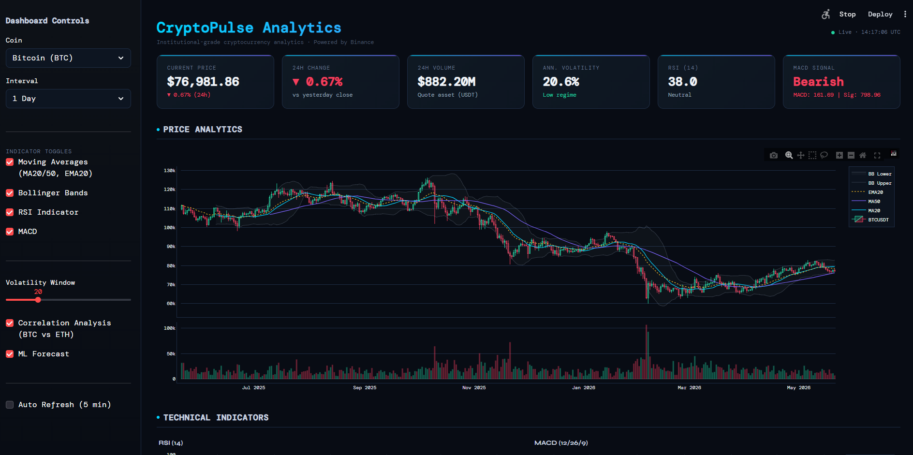
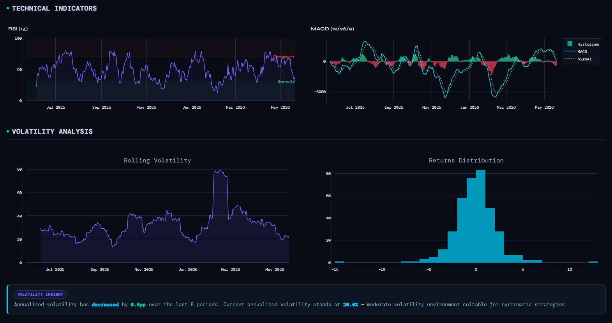
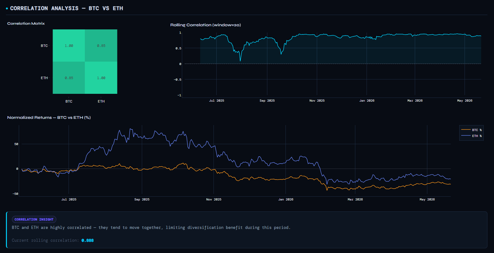

# Crypto Analytics Dashboard

A clean, dark-mode crypto analytics dashboard built with Streamlit and Binance data.

## Preview







## What it includes

- Live Binance OHLCV data for BTC/USDT and ETH/USDT
- Candlestick chart with moving averages and Bollinger Bands
- RSI and MACD technical indicator panels
- Volatility and returns analysis
- BTC/ETH correlation section
- Linear regression forecast and confidence band
- CSV export for chart data and ticker summary

## Run locally

```powershell
python -m venv venv
venv\Scripts\activate
pip install -r requirements.txt
streamlit run app.py
```

Open http://localhost:8501.

## Notes

- Use `BINANCE_API_KEY` in your environment if you have one
- If no API key is set, the app still uses Binance public endpoints
- This project is designed for analysis and demonstration only
