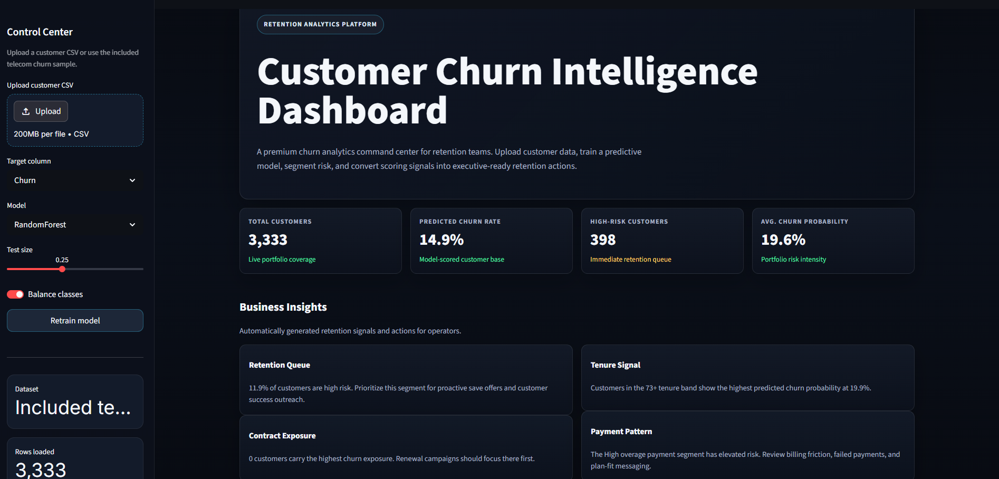
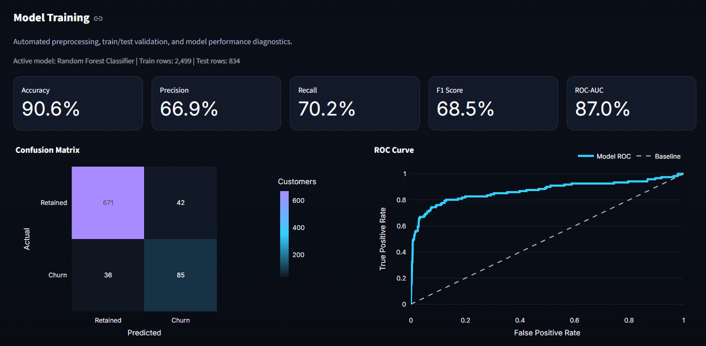
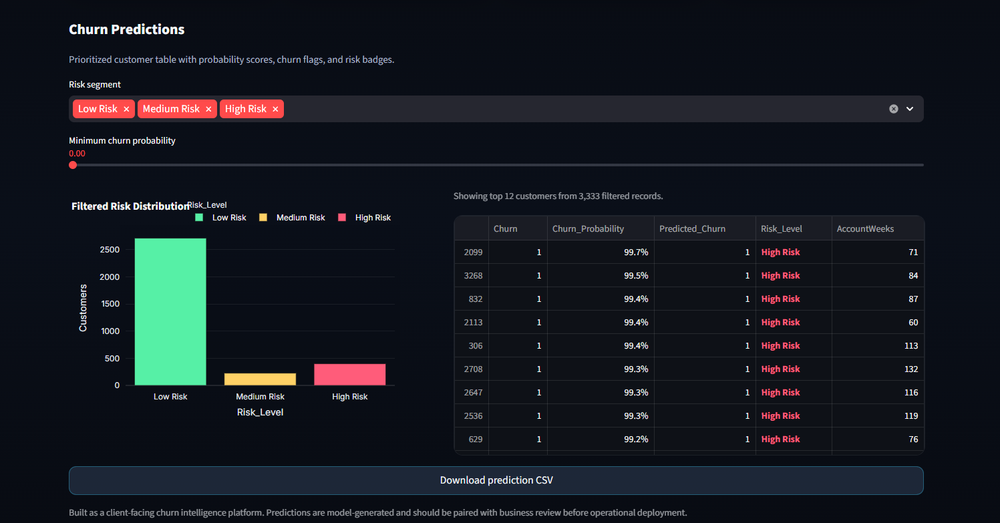

# Customer Churn Intelligence Dashboard

A polished Streamlit dashboard for customer churn analytics, model training, and retention decision support.



## Overview

This project delivers a business-ready churn intelligence experience for subscription-based operations. It includes:

- CSV upload and automated data preparation
- Churn prediction with explainable model outputs
- Risk segmentation and retention recommendations
- Interactive KPI, feature importance, and customer analysis views

## Key Capabilities

- Automated schema detection, missing value handling, encoding, and scaling
- Churn modeling with XGBoost and fallback Random Forest
- Precision, recall, F1, and ROC-AUC performance reporting
- SHAP-based feature explanation and risk segmentation
- Downloadable scored customer output for retention workflows



## Quick Start

```powershell
pip install -r requirements.txt
streamlit run app.py
```

The app ships with `data/telecom_churn.csv` and supports custom customer datasets via CSV upload.

## Deployment

Deploy on Streamlit Community Cloud, Render, Railway, or a private host.

1. Commit `app.py`, `requirements.txt`, and `data/telecom_churn.csv`
2. Set `app.py` as the Streamlit entry point
3. Install dependencies from `requirements.txt`



## Files

- `app.py` — main Streamlit application
- `requirements.txt` — Python dependencies
- `data/telecom_churn.csv` — default sample dataset
- `assets/` — dashboard screenshot assets

## Notes

Designed for portfolio presentation and rapid demonstration of churn analytics, business insights, and ML explainability.
