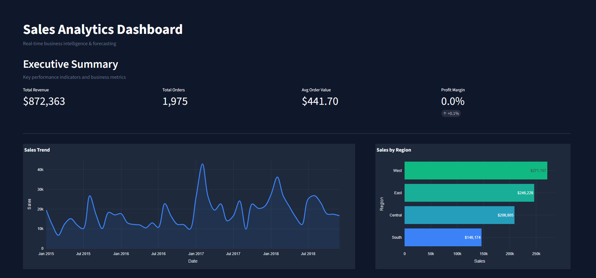
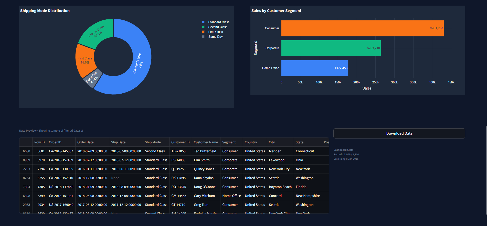
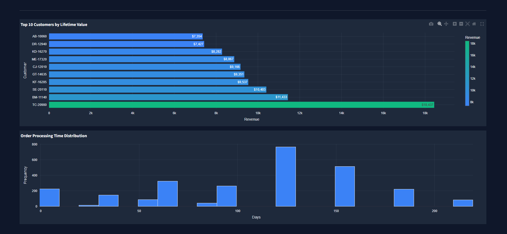

# Sales Analytics Dashboard

A professional business intelligence and forecasting platform built with Streamlit and Plotly. This dashboard delivers real-time sales analytics, forecasting, geographic insights, and customer intelligence through an interactive and executive-friendly interface.

---

# Dashboard Preview

## Executive Overview



## Customer & Operational Insights



## Advanced Customer Metrics



---

# Features

## Executive Summary
- Real-time KPI monitoring
- Revenue tracking and sales performance
- Average order value analysis
- Regional sales insights
- Product and category performance
- Customer segmentation analysis

## Sales Forecasting
- Time-series forecasting models
- Confidence interval visualization
- Trend analysis and future predictions
- Multi-horizon forecasting support

## Geographic Insights
- Regional sales distribution
- State-level performance analysis
- Market opportunity visualization
- Geographic filtering

## Customer Analytics
- Customer lifetime value analysis
- Repeat customer insights
- Order processing time distribution
- Segment-based revenue analysis

---

# Installation

## Prerequisites

- Python 3.8+
- Conda or pip

---

## Setup

### Clone the repository

```bash
git clone https://github.com/yourusername/sales-forecast-dashboard.git
cd sales-forecast-dashboard
```

### Create virtual environment

```bash
conda create -n dashboard python=3.9
conda activate dashboard
```

### Install dependencies

```bash
pip install -r requirements.txt
```

---

# Run the Dashboard

```bash
streamlit run app.py
```

Dashboard will launch at:

```text
http://localhost:8501
```

---

# Project Structure

```text
sales-forecast-dashboard/
│
├── app.py
├── requirements.txt
├── README.md
│
├── assets/
│   ├── dashboard1.png
│   ├── dashboard2.png
│   └── dashboard3.png
│
├── data/
│   └── superstore.csv
│
├── notebooks/
│   └── eda.ipynb
│
├── src/
│   ├── forecasting.py
│   ├── preprocessing.py
│   └── visuals.py
```

---

# Data Features

The dashboard supports:

- Sales trend analysis
- Customer behavior analytics
- Geographic performance metrics
- Shipping performance insights
- Forecasting and predictive analytics

---

# Usage Guide

## Filters
Use sidebar filters to:
- Select date ranges
- Filter by region
- Analyze product categories
- Focus on customer segments

## Forecasting
- Solid lines represent historical sales
- Dashed lines represent forecasted values
- Shaded regions indicate confidence intervals

---

# Performance Optimizations

- Cached dataset loading
- Efficient Pandas transformations
- Responsive dashboard layout
- Optimized Plotly rendering

---

# Future Improvements

- Profit forecasting
- Customer churn prediction
- Automated reporting
- Real-time API integration
- Mobile responsiveness
- ML-powered recommendations

---


# License

This project is for educational and portfolio purposes.

---

**Version:** 2.0  
**Last Updated:** May 2026